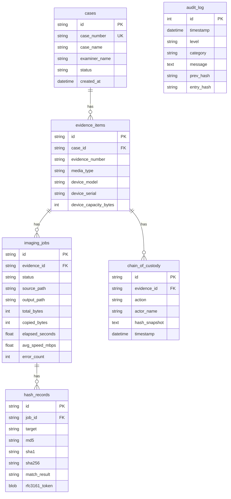

# 🔬 MFEPS — Magia Forensic Evidence Preservation Suite v2.0

<div align="center">

**Pure-Python ベースのデジタルフォレンジック証拠保全スイート**

[](https://www.python.org/)
[](https://nicegui.io/)
[](https://www.sqlite.org/)
[](#)
[](https://www.microsoft.com/windows)

</div>

---

## 📋 概要

MFEPS は **USB/HDD および光学メディア (CD/DVD/BD)** のフォレンジックイメージングに特化したポータブルツールです。

Windows 環境上で **インストール不要・管理者権限で起動するだけ** で、下記の機能を WebUI 上から操作できます。

| 機能 | 説明 |
|------|------|
| 🔒 RAW セクタイメージング | Win32 API (`CreateFileW` / `ReadFile`) 経由で物理デバイスを直接読取 |
| ⚡ 高速ダブルバッファリング | 読取と処理を非同期オーバーラップして最大スループットを実現 |
| 🔑 トリプルハッシュ検証 | MD5 + SHA-1 + SHA-256 をストリーミング同時計算 |
| 💿 光学メディア対応 | CD-DA (2352B/sector) / DVD / BD の RAW イメージング + TOC 解析 |
| 🛡️ コピーガード検出 | CSS / AACS / ARccOS / Disney X-Project / CCCD 等 10 種自動検出 |
| 📄 報告書自動生成 | PDF / HTML 形式のフォレンジック報告書を自動出力 |
| ⛓️ Chain of Custody | 証拠管理連鎖の記録・タイムライン表示・エクスポート |
| 📋 監査ログ | SHA-256 ハッシュチェーンによる改竄検知付き監査ログ |
| ⚖️ 法的準拠 | 証拠保全ガイドライン第10版 / NIST CFTT 準拠設計 |

---

## 🖥️ スクリーンショットイメージ

```
┌──────────────────────────────────────────────────┐
│  🔬 MFEPS  Forensic Evidence Preservation Suite  │  ⚙️
├──────────┬───────────────────────────────────────┤
│          │                                       │
│ メディア  │  🏠 ダッシュボード                     │
│ コピー    │  ┌──────┬──────┬──────┬──────┐       │
│ 💾 USB   │  │ 📁 0  │ 💾 0 │ 📀 0 │ ⚠️ 0│       │
│ 💿 CD/DVD│  │ 案件  │ 証拠品│ ｲﾒｰｼﾞ│ ｴﾗｰ │       │
│          │  └──────┴──────┴──────┴──────┘       │
│ 管理     │                                       │
│ 🏠 HOME  │  最近のイメージングジョブ               │
│ 🔑 HASH  │  ┌────┬────┬────┬────┬────┐         │
│ ⛓️ CoC   │  │日時│案件│証拠│種別│状態│         │
│ 📄 REPORT│  └────┴────┴────┴────┴────┘         │
│ 📋 AUDIT │                                       │
│          │  出力先ディスク容量 ██████░░░░ 62%     │
│ v2.0.0   │                                       │
├──────────┴───────────────────────────────────────┤
│  準備完了                                        │
└──────────────────────────────────────────────────┘
```

---

## 🚀 クイックスタート

### 前提条件

- **Windows 10 / 11** (x64)
- **Python 3.11+** (ポータブル版同梱可)
- **管理者権限** (物理デバイスアクセスに必須)

### 1. 開発環境での起動

```bash
cd mfeps
pip install -r requirements.txt
python src/main.py
```

ブラウザで **http://localhost:8580** にアクセスしてください。

### 2. ポータブル環境 (推奨)

```powershell
cd mfeps
.\setup_portable.ps1       # Python Embedded + 依存パッケージの自動セットアップ
```

以降は **`start.bat` をダブルクリック** するだけで起動できます (UAC 昇格自動)。

---

## 📁 プロジェクト構造

```
mfeps/
├── start.bat                     # UAC昇格付き起動ランチャー
├── setup_portable.ps1            # ポータブル環境構築スクリプト
├── requirements.txt              # Python依存パッケージ
├── .env.example                  # 環境変数テンプレート
│
├── src/
│   ├── main.py                   # アプリエントリーポイント
│   │
│   ├── utils/                    # ユーティリティ
│   │   ├── constants.py          # 定数定義 (Win32 API, UI, バッファ)
│   │   ├── error_codes.py        # E1xxx〜E6xxx エラーコード (28種)
│   │   ├── config.py             # Pydantic設定管理 (.env)
│   │   ├── logger.py             # ロギング (app/imaging/audit.log)
│   │   └── folder_manager.py     # 起動時フォルダ自動生成
│   │
│   ├── models/                   # データモデル
│   │   ├── enums.py              # Enum定義 (11種)
│   │   ├── database.py           # SQLite初期化 (WAL, FK)
│   │   └── schema.py             # ORM (6テーブル)
│   │
│   ├── core/                     # コアエンジン
│   │   ├── win32_raw_io.py       # ctypes Win32 API ラッパー
│   │   ├── device_detector.py    # WMI デバイス列挙
│   │   ├── write_blocker.py      # ソフトウェアライトブロック
│   │   ├── buffer_manager.py     # ダブルバッファリング
│   │   ├── hash_engine.py        # トリプルハッシュ (MD5+SHA1+SHA256)
│   │   ├── imaging_engine.py     # USB/HDD イメージングエンジン
│   │   ├── optical_engine.py     # 光学メディアエンジン
│   │   └── copy_guard_analyzer.py # コピーガード検出 (10種)
│   │
│   ├── services/                 # ビジネスロジック
│   │   ├── imaging_service.py    # イメージングオーケストレータ
│   │   ├── case_service.py       # 案件/証拠品 CRUD
│   │   ├── audit_service.py      # ハッシュチェーン監査ログ
│   │   ├── report_service.py     # PDF/HTML 報告書生成
│   │   └── coc_service.py        # Chain of Custody + RFC3161
│   │
│   └── ui/                       # WebUI (NiceGUI)
│       ├── layout.py             # レイアウト (Header+Sidebar+Footer)
│       ├── theme/modern_dark.py  # ダークモダンテーマ CSS
│       ├── pages/                # ページコンポーネント
│       │   ├── dashboard.py      # ダッシュボード
│       │   ├── settings.py       # 設定
│       │   ├── usb_hdd.py        # USB/HDD ウィザード
│       │   ├── optical.py        # 光学メディア ウィザード
│       │   ├── reports.py        # レポート管理
│       │   ├── coc.py            # CoC 管理
│       │   └── audit.py          # 監査ログビューア
│       └── components/           # 共通UIコンポーネント
│           ├── progress_panel.py # プログレス/ハッシュ比較
│           └── device_card.py    # デバイス情報カード
│
├── data/                         # (自動生成) SQLite DB
├── output/                       # (自動生成) イメージ出力先
├── logs/                         # (自動生成) ログファイル
├── reports/                      # (自動生成) 報告書出力先
├── libs/                         # (手動配置) 外部DLL
└── runtime/                      # (setup_portable.ps1で生成) Python Embedded
```

---

## ⚙️ 技術スタック

| カテゴリ | 技術 |
|---------|------|
| **言語** | Python 3.11+ (Pure Python) |
| **WebUI** | NiceGUI 3.x (FastAPI + Vue/Quasar 統合) |
| **DB** | SQLite 3 (WAL モード, SQLAlchemy ORM) |
| **ディスクI/O** | ctypes + Win32 API (`CreateFileW`, `ReadFile`, `DeviceIoControl`) |
| **ハッシュ** | hashlib (MD5 + SHA-1 + SHA-256 ストリーミング) |
| **光学メディア** | SCSI Pass-Through (`READ CD` CDB 0xBE) |
| **DVD復号** | pydvdcss (libdvdcss-2.dll経由) |
| **BD復号** | libaacs (ctypes, ユーザー提供 keydb.cfg) |
| **PDF生成** | ReportLab |
| **タイムスタンプ** | RFC3161 (rfc3161ng) |
| **非同期** | asyncio + ダブルバッファリング |

---

## 🗃️ データベーススキーマ



---

## 🔒 セキュリティ設計

### ソフトウェアライトブロック

```
1. レジストリ方式 (StorageDevicePolicies\WriteProtect = 1)
2. IOCTL_DISK_IS_WRITABLE によるHWブロッカー検出
3. 書込オープン試行による検証
```

### 監査ログ ハッシュチェーン

```
Entry[0]: hash = SHA256("GENESIS")
Entry[n]: hash = SHA256(Entry[n-1].hash | timestamp | level | category | message | detail)
```

各エントリは前エントリのハッシュを含むため、途中の改竄を検知できます。

---

## 🛡️ コピーガード検出対応

| 保護方式 | メディア | 検出方法 | 復号 |
|---------|---------|---------|------|
| CSS | DVD | pydvdcss | ✅ |
| リージョンコード | DVD | VMG IFO 解析 | ✅ |
| Macrovision/APS | DVD | IFO フラグ | N/A (RAWコピーに影響なし) |
| UOP | DVD | IFO フラグ | N/A |
| Sony ARccOS | DVD | 不良セクタパターン | ✅ |
| Disney X-Project | DVD | 異常VTS数 | ✅ |
| AACS | BD | MKB/AACS ディレクトリ | ⚠️ (keydb.cfg必要) |
| BD+ | BD | BDSVM 検出 | ⚠️ (libbdplus必要) |
| Cinavia | BD | 音声解析 | ❌ |
| CCCD | CD | マルチセッション構造 | ✅ |

---

## 📄 環境変数 (.env)

```ini
MFEPS_PORT=8580                                    # WebUIポート
MFEPS_OUTPUT_DIR=./output                          # イメージ出力先
MFEPS_BUFFER_SIZE=1048576                          # バッファサイズ (1 MiB)
MFEPS_THEME=dark                                   # テーマ (dark/light)
MFEPS_FONT_SIZE=16                                 # フォントサイズ (12-24)
MFEPS_RFC3161_ENABLED=false                        # RFC3161タイムスタンプ
MFEPS_RFC3161_TSA_URL=http://timestamp.digicert.com # TSA URL
MFEPS_DOUBLE_READ_OPTICAL=false                    # 光学メディア2回読取
MFEPS_LOG_LEVEL=INFO                               # ログレベル
DVDCSS_LIBRARY=./libs/libdvdcss-2.dll              # libdvdcss DLLパス
```

---

## 📚 法的準拠

本ツールは以下のガイドラインに準拠して設計されています：

- **デジタル・フォレンジック研究会 証拠保全ガイドライン 第10版**
- **NIST CFTT (Computer Forensics Tool Testing)**
- **ベストプラクティス**: ライトブロック → トリプルハッシュ → 検証 → CoC記録

---

## ⚠️ 注意事項

> **法的免責事項**: 本ツールはデジタルフォレンジックの証拠保全を目的として設計されています。コピーガード解除機能は、正当な法的権限に基づく証拠保全目的でのみ使用可能です。不正競争防止法および著作権法に違反する使用は固く禁じます。

- 管理者権限が必要です (物理デバイスへのアクセスに必須)
- `libdvdcss-2.dll` は GPL-2.0 ライセンスです
- `libaacs` 使用時はユーザーが `keydb.cfg` を用意する必要があります
- システムドライブ (C:) への操作は自動的にブロックされます

---

## 📝 ライセンス

Private — 個人利用限定

---

<div align="center">

**🔬 MFEPS v2.0** — *Forensic Evidence Preservation, Reimagined.*

</div>
