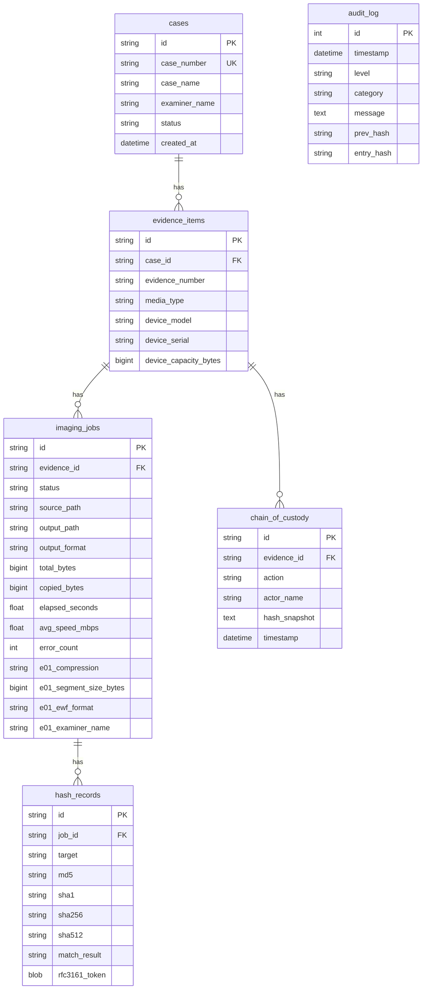

# 🔬 MFEPS — Magia Forensic Evidence Preservation Suite v2.1.0

<div align="center">

**Pure-Python ベースのデジタルフォレンジック証拠保全スイート**

[](https://www.python.org/)
[](https://nicegui.io/)
[](https://www.sqlite.org/)
[](./LICENSE)
[](https://www.microsoft.com/windows)

Language: **日本語** | [English](#english)

</div>

---

<a id="japanese"></a>

## 📋 概要

MFEPS は **USB/HDD および光学メディア (CD/DVD/BD)** のフォレンジックイメージングに特化したポータブルツールです。

Windows 環境上で **インストール不要・管理者権限で起動するだけ** で、下記の機能を WebUI 上から操作できます。

| 機能 | 説明 |
|------|------|
| 🔒 RAW セクタイメージング | Win32 API (`CreateFileW` / `ReadFile`) 経由で物理デバイスを直接読取 |
| ⚡ 高速ダブルバッファリング | 読取と処理を非同期オーバーラップして最大スループットを実現 |
| 🔑 トリプルハッシュ検証 | MD5 + SHA-1 + SHA-256 をストリーミング同時計算 |
| 💿 光学メディア対応 | CD-DA (2352B/sector) / DVD / BD の RAW イメージング + TOC 解析 |
| 🛡️ コピーガード検出 | CSS / AACS / ARccOS / Disney X-Project / CCCD 等 10 種自動検出 |
| 📄 報告書自動生成 | PDF / HTML 形式のフォレンジック報告書を自動出力 |
| ⛓️ Chain of Custody | 証拠管理連鎖の記録・タイムライン表示・エクスポート |
| 📋 監査ログ | SHA-256 ハッシュチェーンによる改竄検知付き監査ログ |
| ⚖️ 法的準拠 | 証拠保全ガイドライン第10版 / NIST CFTT 準拠設計 |
| 💿 E01 出力 | USB/HDD を Expert Witness Format（E01）で保全（libewf / `ewfacquire`、オプション） |

---

## 💿 E01 出力 (v2.1.0)

MFEPS は **libewf** の `ewfacquire` を subprocess で呼び出し、USB/HDD を **E01 (EnCase Evidence File)** 形式で保全できます。バイナリは同梱せず、ユーザーが入手して配置します。

### 機能

- EnCase 5 / 6 / 7 および EWFX（`-f`）に対応した E01 系出力
- deflate 圧縮（`method:level` 形式、`none` / `empty-block` / `fast` / `best`）
- 設定可能なセグメントサイズ（バイト単位、`encase6` では大容量セグメント可）
- ケース番号・証拠番号・鑑識者名・説明・備考の E01 ヘッダ埋め込み
- 取得時ハッシュ: **MD5 + SHA-256** の 2 系統
- `ewfverify` による取得後の自動検証（パス未設定時はスキップ）
- **設定画面**でのパス指定・接続テスト・デフォルト取得パラメータ（`app.storage` 優先）
- HTML / PDF レポートへの E01 情報セクション
- 取得後の **ewfinfo** による E01 埋め込みメタデータ表示（`ewfinfo.exe` が見つかる場合）。パスが長すぎる等でメタデータ取得に失敗しても **イメージングジョブ自体は成功扱い**（警告ログのみ）
- 監査ログへのコマンドライン記録

> **SHA-1 について**: libewf 20230405 は SHA-1 を stdout・ログ・E01 ヘッダのいずれにも出力しません。
> NIST が 2011 年に SHA-1 を非推奨としていることも踏まえ、E01 出力では **MD5 + SHA-256 の 2 系統** で運用しています。
> RAW イメージングでは従来どおり MD5 + SHA-1 + SHA-256 のトリプルハッシュが使用されます。

### セットアップ

1. `ewfacquire.exe`（および任意で `ewfverify.exe`）を配置する（手順は [`libs/README_ewftools.md`](libs/README_ewftools.md)）。
   - **推奨入手元**: [alpine-sec/ewf-tools v20230405-2](https://github.com/alpine-sec/ewf-tools/releases)
2. `.env` の `EWFACQUIRE_PATH` / `EWFVERIFY_PATH` を設定するか、**設定 → E01 出力**でパスを入力し **接続テスト** を成功させる。
   - `libs/` 直下に配置すれば `.env` 設定なしで自動検出されます。
3. **USB/HDD** ウィザードで出力形式 **E01** を選択する。

### libewf 20230405 の既知制限

| 項目 | 状況 |
|------|------|
| MD5 | E01 ヘッダに格納、stdout に出力。**唯一完全に動作するハッシュ** |
| SHA-256 | stdout のサマリーに出力するが **E01 ヘッダには格納しない**（ewfinfo で確認済み） |
| SHA-1 | stdout にもログにも E01 ヘッダにも出力されない。`-d sha1` は内部計算のみ |
| ewfinfo | 長いパスで `invalid filenames` 等になり得る。MFEPS は当該ステップをスキップしジョブは継続（短い出力パスを推奨） |

### 実機テスト結果（v2.1.0）

**USB E01（Sony 4 GB USB メモリ、`\\.\PhysicalDrive4`）**

| 項目 | 結果 |
|------|------|
| フォーマット | EnCase 6, deflate:fast |
| セグメント | 1,500,000,000 bytes × 2 + 残余 |
| 総バイト数 | 3,926,950,076 bytes |
| 所要時間 | 79.1 秒（平均 47.3 MiB/s） |
| MD5 | `fe00fe0ce5792f54c069b2917c6082cf` |
| SHA-256 | `1c3b0858c395d278277ec944b768be4ed1b6d2dc9eae459b3f2baffe71930f26` |
| ewfverify | SUCCESS |
| レポート | ハッシュ一致、完全性確認済み |

**CD ISO（CD-ROM ISO9660、`\\.\CdRom0`）**

| 項目 | 結果 |
|------|------|
| フォーマット | ISO |
| 総バイト数 | 471,828,480 bytes（230,385 セクタ） |
| 所要時間 | 100.4 秒（平均 4.5 MiB/s） |
| MD5 | `2a05c21dc45c33b719b659045aa55571` |
| SHA-256 | `b3b547298487a451ce7f6c4c6cd01164e2b2a37fdb455b54dfbf2c37d08176d8` |
| レポート | ハッシュ一致、完全性確認済み |
| 書き込み保護 | ハードウェアライトブロッカー |

詳細なテスト記録は [`tests/integration/e01_test_results_20260331.md`](tests/integration/e01_test_results_20260331.md) を参照してください。

### ライセンス

`ewfacquire` / `ewfverify` は **LGPL-3.0+** です。MFEPS 本体（MIT）とは別物としてユーザーが入手・配置してください。詳細は [`THIRD_PARTY_LICENSES.md`](THIRD_PARTY_LICENSES.md)。

---
## 🖥️ スクリーンショットイメージ

```
┌──────────────────────────────────────────────────┐
│  🔬 MFEPS  Forensic Evidence Preservation Suite  │  ⚙️
├──────────┬───────────────────────────────────────┤
│          │                                       │
│ メディア  │  🏠 ダッシュボード                     │
│ コピー    │  ┌──────┬──────┬──────┬──────┐       │
│ 💾 USB   │  │ 📁 0  │ 💾 0 │ 📀 0 │ ⚠️ 0│       │
│ 💿 CD/DVD│  │ 案件  │ 証拠品│ ｲﾒｰｼﾞ│ ｴﾗｰ │       │
│          │  └──────┴──────┴──────┴──────┘       │
│ 管理     │                                       │
│ 🏠 HOME  │  最近のイメージングジョブ               │
│ 🔑 HASH  │  ┌────┬────┬────┬────┬────┐         │
│ ⛓️ CoC   │  │日時│案件│証拠│種別│状態│         │
│ 📄 REPORT│  └────┴────┴────┴────┴────┘         │
│ 📋 AUDIT │                                       │
│          │  出力先ディスク容量 ██████░░░░ 62%     │
│ v2.1.0   │                                       │
├──────────┴───────────────────────────────────────┤
│  準備完了                                        │
└──────────────────────────────────────────────────┘
```

---

## 🚀 クイックスタート

### 前提条件

- **Windows 10 / 11** (x64)
- **Python 3.11+** (ポータブル版同梱可)
- **管理者権限** (物理デバイスアクセスに必須)

### 1. 開発環境での起動

```bash
cd mfeps
pip install -r requirements.txt
python src/main.py
```

ブラウザで **http://localhost:8580** にアクセスしてください。

### 2. ポータブル環境 (推奨)

```powershell
cd mfeps
.\setup_portable.ps1       # Python Embedded + 依存パッケージの自動セットアップ
```

以降は **`start.bat` をダブルクリック** するだけで起動できます (UAC 昇格自動)。

### 3. テスト

```bash
pytest tests/ -q          # 68 件全通過
python tests/integration/test_stdout_parser.py
```

---

<a id="jp-project-structure"></a>

## 📁 プロジェクト構造

```
mfeps/
├── start.bat                     # UAC昇格付き起動ランチャー
├── setup_portable.ps1            # ポータブル環境構築スクリプト
├── requirements.txt              # Python依存パッケージ
├── .env.example                  # 環境変数テンプレート
│
├── src/
│   ├── main.py                   # アプリエントリーポイント
│   │
│   ├── utils/                    # ユーティリティ
│   │   ├── constants.py          # 定数定義 (Win32 API, UI, E01 正規表現)
│   │   ├── error_codes.py        # E1xxx〜E7xxx エラーコード
│   │   ├── config.py             # Pydantic設定管理 (.env) + ewftools 自動検出
│   │   ├── logger.py             # ロギング (app/imaging/audit.log)
│   │   └── folder_manager.py     # 起動時フォルダ自動生成
│   │
│   ├── models/                   # データモデル
│   │   ├── enums.py              # Enum定義 (OutputFormat に E01 含む)
│   │   ├── database.py           # SQLite初期化 (WAL, FK)
│   │   └── schema.py             # ORM (8テーブル、BigInteger 対応済み)
│   │
│   ├── core/                     # コアエンジン
│   │   ├── win32_raw_io.py       # ctypes Win32 API ラッパー
│   │   ├── device_detector.py    # WMI デバイス列挙
│   │   ├── write_blocker.py      # ソフトウェアライトブロック
│   │   ├── buffer_manager.py     # ダブルバッファリング
│   │   ├── hash_engine.py        # トリプルハッシュ (MD5+SHA1+SHA256)
│   │   ├── imaging_engine.py     # USB/HDD イメージングエンジン
│   │   ├── e01_writer.py         # E01 取得・検証 (ewfacquire/ewfverify)
│   │   ├── optical_engine.py     # 光学メディアエンジン (run_in_executor)
│   │   └── copy_guard_analyzer.py # コピーガード検出 (10種)
│   │
│   ├── services/                 # ビジネスロジック
│   │   ├── imaging_service.py    # イメージングオーケストレータ (RAW/E01)
│   │   ├── optical_service.py    # 光学メディアサービス
│   │   ├── case_service.py       # 案件/証拠品 CRUD
│   │   ├── audit_service.py      # ハッシュチェーン監査ログ
│   │   ├── report_service.py     # PDF/HTML 報告書生成
│   │   └── coc_service.py        # Chain of Custody + RFC3161
│   │
│   └── ui/                       # WebUI (NiceGUI)
│       ├── layout.py             # レイアウト (Header+Sidebar+Footer)
│       ├── theme/modern_dark.py  # ダークモダンテーマ CSS
│       ├── pages/                # ページコンポーネント
│       │   ├── dashboard.py      # ダッシュボード
│       │   ├── settings.py       # 設定 (E01 設定カード含む)
│       │   ├── usb_hdd.py        # USB/HDD ウィザード (RAW/E01 選択)
│       │   ├── optical.py        # 光学メディア ウィザード
│       │   ├── reports.py        # レポート管理
│       │   ├── coc.py            # CoC 管理
│       │   └── audit.py          # 監査ログビューア
│       └── components/           # 共通UIコンポーネント
│           ├── progress_panel.py # プログレス/ハッシュ比較
│           ├── device_card.py    # デバイス情報カード
│           └── legal_consent_dialog.py # 法的同意ダイアログ
│
├── tests/
│   ├── test_e01_writer.py        # E01 パーサー・コマンド生成 17+ 件
│   └── integration/              # 実機統合テスト基盤
│       ├── test_stdout_parser.py
│       └── e01_test_results_20260331.md
│
├── data/                         # (自動生成) SQLite DB
├── output/                       # (自動生成) イメージ出力先
├── logs/                         # (自動生成) ログファイル
├── reports/                      # (自動生成) 報告書出力先
├── libs/                         # (手動配置) ewftools + 外部DLL
│   └── README_ewftools.md        # ewftools 配置手順
└── runtime/                      # (setup_portable.ps1で生成) Python Embedded
```

---

## ⚙️ 技術スタック

| カテゴリ | 技術 |
|---------|------|
| **言語** | Python 3.11+ (Pure Python) |
| **WebUI** | NiceGUI 3.9.0 (FastAPI + Vue/Quasar 統合) |
| **DB** | SQLite 3 (WAL モード, SQLAlchemy ORM) |
| **ディスクI/O** | ctypes + Win32 API (`CreateFileW`, `ReadFile`, `DeviceIoControl`) |
| **ハッシュ** | hashlib (MD5 + SHA-1 + SHA-256 ストリーミング) |
| **光学メディア** | SCSI Pass-Through (`READ CD` CDB 0xBE) |
| **DVD復号** | pydvdcss (libdvdcss-2.dll経由、オプション) |
| **BD復号** | libaacs (ctypes、ユーザー提供 keydb.cfg) |
| **E01出力** | ewfacquire / ewfverify (libewf 20230405、外部バイナリ) |
| **PDF生成** | ReportLab |
| **タイムスタンプ** | RFC3161 (rfc3161ng) |
| **非同期** | asyncio + ダブルバッファリング |

---

<a id="jp-database-schema"></a>

## 🗃️ データベーススキーマ



---
## 🔒 セキュリティ設計

### ソフトウェアライトブロック

```
1. レジストリ方式 (StorageDevicePolicies\WriteProtect = 1)
2. IOCTL_DISK_IS_WRITABLE によるHWブロッカー検出
3. 書込オープン試行による検証
```

> **制限事項**: ソフトウェアライトブロックは Windows カーネルレベル（レジストリベース）で動作し、
> BIOS/UEFI レベルや USB ファームウェアレベルの書き込みは防止できません。
> 裁判で使用する証拠には、ハードウェアライトブロッカー（Tableau、CRU 等）との併用を推奨します。
> レポートでは保護方式を自動表示し、ソフトウェアのみの場合は警告を出力します。

### 監査ログ ハッシュチェーン

```
Entry[0]: hash = SHA256("GENESIS")
Entry[n]: hash = SHA256(Entry[n-1].hash | timestamp | level | category | message | detail)
```

各エントリは前エントリのハッシュを含むため、途中の改竄を検知できます。

---

## 🛡️ コピーガード検出対応

| 保護方式 | メディア | 検出方法 | 復号 |
|---------|---------|---------|------|
| CSS | DVD | pydvdcss | ✅ |
| リージョンコード | DVD | VMG IFO 解析 | ✅ |
| Macrovision/APS | DVD | IFO フラグ | N/A (RAWコピーに影響なし) |
| UOP | DVD | IFO フラグ | N/A |
| Sony ARccOS | DVD | 不良セクタパターン | ✅ |
| Disney X-Project | DVD | 異常VTS数 | ✅ |
| AACS | BD | MKB/AACS ディレクトリ | ⚠️ (keydb.cfg必要) |
| BD+ | BD | BDSVM 検出 | ⚠️ (libbdplus必要) |
| Cinavia | BD | 音声解析 | ❌ |
| CCCD | CD | マルチセッション構造 | ✅ |

---

## 📄 環境変数 (.env)

```ini
MFEPS_PORT=8580                                    # WebUIポート
MFEPS_OUTPUT_DIR=./output                          # イメージ出力先
MFEPS_BUFFER_SIZE=1048576                          # バッファサイズ (1 MiB)
MFEPS_THEME=dark                                   # テーマ (dark/light)
MFEPS_FONT_SIZE=16                                 # フォントサイズ (12-24)
MFEPS_RFC3161_ENABLED=false                        # RFC3161タイムスタンプ
MFEPS_RFC3161_TSA_URL=http://timestamp.digicert.com # TSA URL
MFEPS_DOUBLE_READ_OPTICAL=false                    # 光学メディア2回読取
MFEPS_LOG_LEVEL=INFO                               # ログレベル
DVDCSS_LIBRARY=./libs/libdvdcss-2.dll              # libdvdcss DLLパス
BIND_ADDRESS=127.0.0.1                             # バインドアドレス
SESSION_TIMEOUT_HOURS=8                            # セッション有効期限

# E01 出力（オプション — libs/ 配置なら自動検出）
EWFACQUIRE_PATH=                                   # ewfacquire.exe パス
EWFVERIFY_PATH=                                    # ewfverify.exe パス
```

---

## 📚 法的準拠

本ツールは以下のガイドラインに準拠して設計されています：

- **デジタル・フォレンジック研究会 証拠保全ガイドライン 第10版**
- **NIST CFTT (Computer Forensics Tool Testing)**
- **ベストプラクティス**: ライトブロック → トリプルハッシュ → 検証 → CoC記録

---

## ⚠️ 注意事項

> **法的免責事項**: 本ツールはデジタルフォレンジックの証拠保全を目的として設計されています。コピーガード解除機能は、正当な法的権限に基づく証拠保全目的でのみ使用可能です。不正競争防止法および著作権法に違反する使用は固く禁じます。

- 管理者権限が必要です (物理デバイスへのアクセスに必須)
- `libdvdcss-2.dll` は GPL-2.0-or-later（オプション・ユーザー配置）。CSS 復号用の `pydvdcss`（GPL-3.0）はオプション依存 — 詳細は [THIRD_PARTY_LICENSES.md](./THIRD_PARTY_LICENSES.md)
- `libaacs` 使用時はユーザーが `keydb.cfg` を用意する必要があります
- システムドライブ (C:) への操作は自動的にブロックされます

---

## 📝 ライセンス

本プロジェクトは **MIT License** の下で公開されています。詳細は [LICENSE](./LICENSE) を参照してください。

### サードパーティ ライセンス

MFEPS が依存する外部ライブラリのライセンス情報は [THIRD_PARTY_LICENSES.md](./THIRD_PARTY_LICENSES.md) を参照してください。

> **GPL 分離方針**: CSS 復号機能に使用する `pydvdcss` (GPL-3.0) はオプション依存です。
> MFEPS 本体は pydvdcss なしで完全に動作します（CSS 復号が無効になるのみ）。
> pydvdcss をインストールして使用する場合、そのコンポーネントに GPL-3.0 が適用されます。
> libaacs (LGPL-2.1) は動的リンク (ctypes) のため、MIT ライセンスとの互換性に問題はありません。

---

<div align="center">

**MFEPS v2.1.0** — _Forensic Evidence Preservation, Reimagined._

</div>

---

<a id="english"></a>

<!-- ============================================================ -->
<!-- ENGLISH SECTION                                               -->
<!-- ============================================================ -->

<div align="center">

# 🔬 MFEPS — Magia Forensic Evidence Preservation Suite v2.1.0

**Pure-Python Digital Forensic Evidence Preservation Suite**

Language: [日本語](#japanese) | **English**

</div>

---

## 📋 Overview

MFEPS is a portable forensic imaging tool specialized for **USB/HDD and optical media (CD/DVD/Blu-ray)** on Windows.

It requires **no installation** — just run with administrator privileges and access the full feature set through a browser-based WebUI.

| Feature | Description |
|---------|-------------|
| 🔒 RAW Sector Imaging | Direct physical device access via Win32 API (`CreateFileW` / `ReadFile`) |
| ⚡ Double Buffering | Asynchronous read/process overlap for maximum throughput |
| 🔑 Triple Hash Verification | Simultaneous streaming MD5 + SHA-1 + SHA-256 |
| 💿 Optical Media Support | CD-DA (2352 B/sector), DVD, BD — RAW imaging + TOC analysis |
| 🛡️ Copy Protection Detection | 10 types: CSS, AACS, ARccOS, Disney X-Project, CCCD, and more |
| 📄 Automated Reporting | PDF / HTML forensic reports |
| ⛓️ Chain of Custody | Full evidence chain recording, timeline view, and export |
| 📋 Audit Log | Tamper-evident SHA-256 hash-chained audit trail |
| 🔐 Authentication | Local password authentication with session management |
| ⚖️ Legal Compliance | Designed per Japanese Digital Forensic Guidelines (10th ed.) / NIST CFTT |
| 💿 E01 Output | USB/HDD imaging to Expert Witness Format via libewf `ewfacquire` (optional) |

### E01 Output (v2.1.0)

MFEPS can acquire USB/HDD to **E01** using **libewf** `ewfacquire` (subprocess). Binaries are **not** bundled; you must supply them.

**Features:** configurable segment size and `encase5`/`encase6`/`encase7`/`ewfx`, deflate `method:level` compression, case/evidence/examiner metadata, optional `ewfverify`, settings UI with connection test, HTML/PDF report section, audit log of command line.

**Hashing:** E01 output uses **MD5 + SHA-256** (two-algorithm verification). SHA-1 is not used because libewf 20230405 does not output SHA-1 to stdout, log files, or E01 headers, and NIST deprecated SHA-1 in 2011. RAW imaging continues to use triple hashing (MD5 + SHA-1 + SHA-256).

**Setup:** place `ewfacquire.exe` (and optionally `ewfverify.exe`) in `libs/` for auto-detection, or set `EWFACQUIRE_PATH` / `EWFVERIFY_PATH` in `.env` or **Settings → E01**, run **connection test**, then choose **E01** on the USB/HDD wizard. Recommended source: [alpine-sec/ewf-tools v20230405-2](https://github.com/alpine-sec/ewf-tools/releases). See also [`libs/README_ewftools.md`](libs/README_ewftools.md).

**Known limitations of libewf 20230405:**
- MD5: stored in E01 header and printed to stdout (fully functional)
- SHA-256: printed to stdout summary but **not stored in E01 header**
- SHA-1: not output anywhere; `-d sha1` performs internal calculation only
- ewfinfo: `invalid filenames` error with long paths (copy to a short path as workaround)

**License:** LGPL-3.0+ for libewf tools; see [`THIRD_PARTY_LICENSES.md`](THIRD_PARTY_LICENSES.md).

**Test results:** [`tests/integration/e01_test_results_20260331.md`](tests/integration/e01_test_results_20260331.md).

## 🚀 Quick Start

### Prerequisites

- **Windows 10 / 11** (x64)
- **Python 3.11+** (portable edition can be bundled)
- **Administrator privileges** (required for physical device access)

### Option 1: Development

```bash
cd mfeps
pip install -r requirements.txt
python src/main.py
```

Open **http://localhost:8580** in your browser.

### Option 2: Portable (Recommended)

```powershell
cd mfeps
.\setup_portable.ps1       # Auto-setup Python Embedded + dependencies
```

Then double-click **`start.bat`** (UAC elevation is automatic).

### Tests

```bash
pytest tests/ -q            # 68 tests pass
python tests/integration/test_stdout_parser.py
```

### Optional: CSS Decryption

To enable CSS decryption for DVD forensic imaging:

```bash
pip install pydvdcss>=1.4.0
```

Place `libdvdcss-2.dll` in the `./libs/` directory. Note: pydvdcss is licensed under GPL-3.0. See [THIRD_PARTY_LICENSES.md](./THIRD_PARTY_LICENSES.md) for details.

## ⚙️ Tech Stack

| Category | Technology |
|----------|-----------|
| **Language** | Python 3.11+ (Pure Python) |
| **WebUI** | NiceGUI 3.9.0 (FastAPI + Vue/Quasar) |
| **Database** | SQLite 3 (WAL mode, SQLAlchemy ORM) |
| **Disk I/O** | ctypes + Win32 API (`CreateFileW`, `ReadFile`, `DeviceIoControl`) |
| **Hashing** | hashlib (MD5 + SHA-1 + SHA-256 streaming) |
| **Optical** | SCSI Pass-Through (`READ CD` CDB 0xBE) |
| **DVD Decrypt** | pydvdcss / libdvdcss (optional, GPL-3.0) |
| **BD Decrypt** | libaacs (optional, LGPL-2.1, user-provided keydb.cfg) |
| **E01 Output** | ewfacquire / ewfverify (libewf 20230405, external binary) |
| **PDF** | ReportLab |
| **Timestamps** | RFC 3161 (rfc3161ng) |
| **Async** | asyncio + double buffering |

## 📁 Project Structure

See [プロジェクト構造 (Japanese)](#jp-project-structure) — the directory tree and file descriptions are language-independent.

## 🗃️ Database Schema

See [データベーススキーマ (Japanese)](#jp-database-schema) — the Mermaid ER diagram is shared.

## 🔒 Security Design

### Software Write Blocker

MFEPS applies a registry-based write-block (`StorageDevicePolicies\WriteProtect = 1`), verifies hardware write-blocker presence via `IOCTL_DISK_IS_WRITABLE`, and performs a write-open test as a final check.

> **Limitation**: Software write-blocking operates at the Windows kernel level
> (registry-based) and cannot prevent BIOS/UEFI-level or USB firmware-level writes.
> For court-admissible evidence, use a hardware write blocker (e.g., Tableau, CRU)
> in combination with MFEPS's software write-block. Reports automatically flag the
> protection method used and display warnings when only software protection is active.

### Hash-Chained Audit Log

```
Entry[0]: hash = SHA256("GENESIS")
Entry[n]: hash = SHA256(Entry[n-1].hash | timestamp | level | category | message | detail)
```

Each entry includes the previous entry's hash, enabling detection of any mid-chain tampering.

### Authentication

Local password authentication with bcrypt hashing and session-based access control. All login/logout events are recorded in the hash-chained audit log.

## 🛡️ Copy Protection Detection

| Protection | Media | Detection | Decrypt |
|-----------|-------|-----------|---------|
| CSS | DVD | pydvdcss | ✅ (optional) |
| Region Code | DVD | VMG IFO analysis | ✅ |
| Macrovision/APS | DVD | IFO flags | N/A (no RAW impact) |
| UOP | DVD | IFO flags | N/A |
| Sony ARccOS | DVD | 99-track + bad-sector pattern | ✅ |
| Disney X-Project | DVD | Anomalous VTS count + size | ✅ |
| AACS | BD | MKB/AACS directory scan | ⚠️ (keydb.cfg required) |
| BD+ | BD | BDSVM signature | ⚠️ (libbdplus required) |
| Cinavia | BD | Audio analysis | ❌ |
| CCCD | CD | Multi-session structure | ✅ |

## 📄 Configuration (.env)

```ini
MFEPS_PORT=8580                    # WebUI port
MFEPS_OUTPUT_DIR=./output          # Image output directory
MFEPS_BUFFER_SIZE=1048576          # Buffer size (1 MiB)
MFEPS_THEME=dark                   # Theme (dark/light)
MFEPS_FONT_SIZE=16                 # Font size (12-24)
MFEPS_RFC3161_ENABLED=false        # RFC 3161 timestamping
MFEPS_RFC3161_TSA_URL=http://timestamp.digicert.com
MFEPS_DOUBLE_READ_OPTICAL=false    # Double-read optical media
MFEPS_LOG_LEVEL=INFO               # Log level
DVDCSS_LIBRARY=./libs/libdvdcss-2.dll
BIND_ADDRESS=127.0.0.1             # WebUI bind address
SESSION_TIMEOUT_HOURS=8            # Session timeout

# E01 output (optional — auto-detected if placed in libs/)
EWFACQUIRE_PATH=                   # Path to ewfacquire.exe
EWFVERIFY_PATH=                    # Path to ewfverify.exe
```

## ⚖️ Legal Compliance

This tool is designed in accordance with:

- **IDF (Institute of Digital Forensics) Evidence Preservation Guidelines, 10th Edition** (Japan)
- **NIST CFTT (Computer Forensics Tool Testing)**
- **Best Practice**: Write-block → Triple hash → Verify → Chain of Custody

## ⚠️ Disclaimer

> **Legal Notice**: This tool is designed exclusively for digital forensic evidence preservation.
> Copy protection analysis features are intended only for use under lawful authority
> for evidence preservation purposes. Use in violation of the Unfair Competition
> Prevention Act (Japan) or Copyright Act (Japan) is strictly prohibited.

- Administrator privileges are required for physical device access
- `libdvdcss-2.dll` is GPL-2.0-or-later; `pydvdcss` is GPL-3.0 (optional, not bundled)
- `libaacs` requires user-provided `keydb.cfg`
- Operations on the system drive (C:) are automatically blocked

## 📝 License

This project is licensed under the **MIT License**. See [LICENSE](./LICENSE).

For third-party license details, see [THIRD_PARTY_LICENSES.md](./THIRD_PARTY_LICENSES.md).

> **GPL Isolation Policy**: `pydvdcss` (GPL-3.0), used for CSS decryption, is an optional dependency.
> MFEPS operates fully without it (CSS decryption is simply disabled).
> If you install pydvdcss, GPL-3.0 applies to that component.
> `libaacs` (LGPL-2.1) is loaded via ctypes (dynamic linking), which is compatible with the MIT License.

---

<div align="center">

**MFEPS v2.1.0** — _Forensic Evidence Preservation, Reimagined._

</div>
